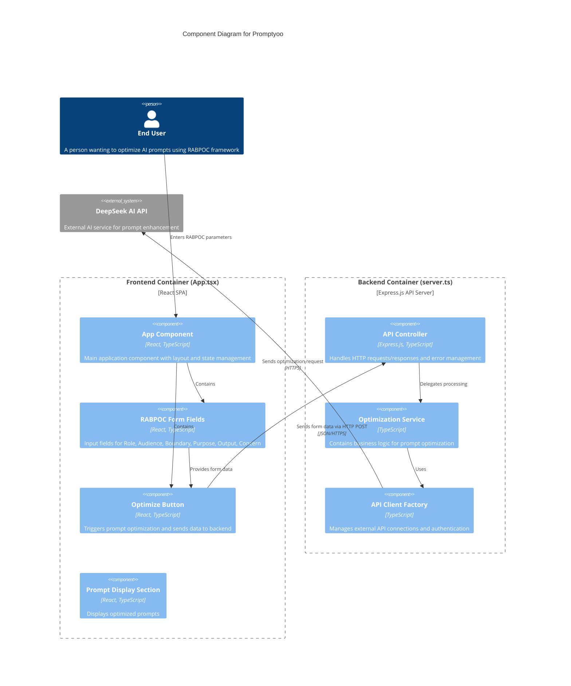
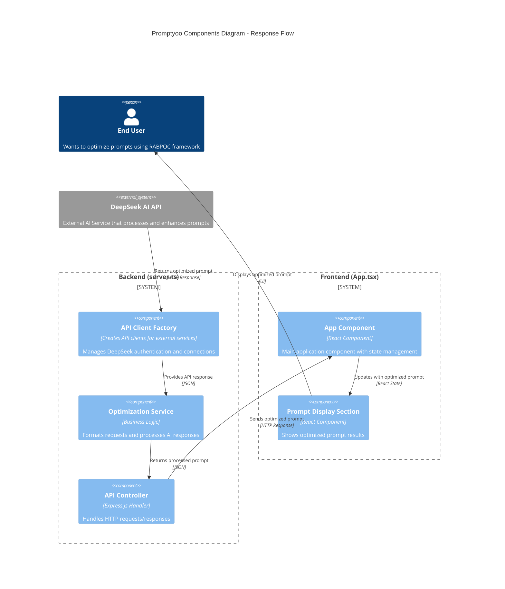

# 提示词 - 发送请求

请根据以下C4 model架构描述，生成c4 model风格的Mermaid脚本以可视化架构图。要求：
1. 仅绘制components层级的图
2. 图中需包含end user
3. 仅展示从end user向前端发送请求到deepseek api接收请求的流程（无需展示优化后提示词的返回流程）
4. 在每个component中标注其所在的文件名

以下是详细描述：（见[prompt-architecture-desc.md](prompt-architecture-desc.md)，略）

# 大模型生成的Mermaid脚本 - 发送请求

# 提示词 - 返回响应

请根据以下C4 model架构描述，生成c4 model风格的Mermaid脚本以可视化架构图。要求：
1. 仅绘制components层级的图
2. 图中需包含end user
3. 仅展示从deepseek api向后端返回结果，直到end user接收优化后的提示词的流程（无需展示提示词优化的发送流程）
4. 在每个component中标注其所在的文件名

以下是详细描述：（见[prompt-architecture-desc.md](prompt-architecture-desc.md)，略）

# 大模型生成的Mermaid脚本 - 返回响应

